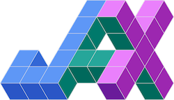

<table>
	<tr>
		<td>
			

				<h2 style="margin: 0 0 8px 0;">Hi, I'm Divij!</h2>
				
I am a PhD student in Computational and Applied Mathematics at Imperial College London. I spend a lot of time with PDE solvers - from writing FVM and FEM codes in C++ from scratch, to designing high performance Physics Informed Machine Learning libraries, and, more recently, with the <a href="https://github.com/firedrakeproject/firedrake">Firedrake</a> framework. 

                
<a href="https://divijghose.github.io">Website</a> | <a href="https://scholar.google.com/citations?user=3R6sbA0AAAAJ&hl=en">Google Scholar</a>

			

		</td>
		<td align="right" valign="top">
			
		</td>
	</tr>
</table>

<h2>Software & Tools</h2>
<h3>A few examples of the software and tools I develop, use, and contribute to:</h3>

	
	
	
	<a href="https://airexlab.github.io/fastvpinns/" title="fastvpinns" style="display: inline-block; margin-right: 8px;">
		

